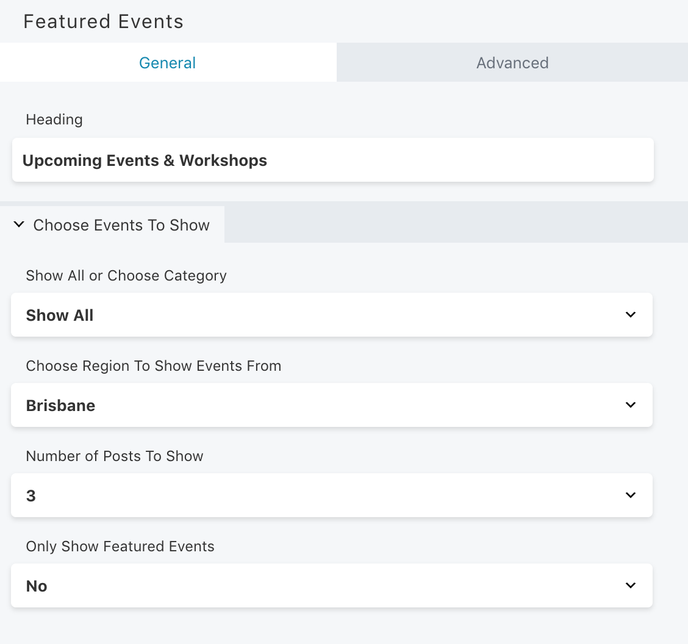

# Beaver Builder Custom Tribes Event Module

Custom Beaver Builder module that displays Tribes Event Calendar events by chosen category or "region".

Used to show "featured events" or pull in a certain amount of events to highlight.

## Details

- Outputs HTML making use of Bootstrap 4's card component
- CSS styles added via theme rather than embedded in the module
- outputs some event post meta on card such start date and end date, and venue
- Choose event category to feature
- Makes use of custom taxonomy to choose region/location of events
- Set heading text for module for example "Upcoming Events" which shows above outputted events
- set amount of events to show
- choose whether to only show "featured" events which checks if a Tribe Event uses the featured option

**NOTE:** The custom taxonomy "region" must be setup separately to this plugin.

